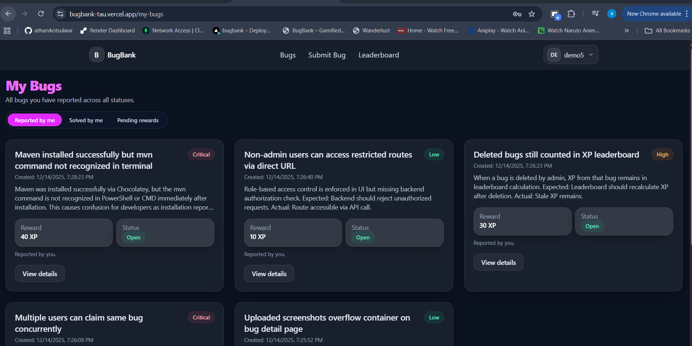

# 🐞 BugBank – Gamified Bug Bounty Platform  
A full-stack production-ready MERN application featuring real-time bug reporting, claim workflow, XP rewards, image uploads, role-based dashboards, Cloudinary integration, and a complete admin system.

## 🚀 Live Links
- **Frontend:** https://bugbank-tau.vercel.app
- **Backend (API):** https://bugbank-backend.onrender.com
- **API Docs (Swagger):** https://bugbank-backend.onrender.com/api/docs

---

## 🧩 Tech Stack
### 🖥 Frontend
- React + Vite + TailwindCSS (v4)
- React Router
- Secure API client wrapper
- Dynamic UI components (Leaderboard, XP Bar, Admin Table)

### ⚙ Backend
- Node.js + Express
- MongoDB (Mongoose)
- JWT Authentication + Role-Based Access
- Cloudinary image upload
- XP transaction engine
- Rate limits + Error handling middleware
- Swagger API documentation

---

## ⭐ Core Features
### 🐞 Bug Reporting System
- Multi-image uploads (Cloudinary)
- Severity tags (High/Medium/Low)
- Search, filter, sort bugs
- Detailed bug view with discussion thread

### 🧑‍💻 Claim & Resolve Workflow
- Users can claim bugs
- Admin approval workflow
- XP rewards for valid resolutions
- XP history tracking

### 🏆 Leaderboard System
- Global ranking based on XP
- Weekly performance stats

### 🔐 User & Admin Dashboards
- Role-based routing
- Admin can view all users, all bugs
- Admin can verify/resolve bugs

---

- ## 📸 Screenshots

### Bug List

### Create Bug

### Bug Detail

### Leaderboard

### Userbug Status

